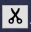

# 大作业文档
软件学院：刘博非 2021010612
## 编译运行
1. 双击打开\.pro文件可进入Qt creator中查看源代码，点击左下角的运行按钮即可运行程序。
2. 点击bin文件夹中的\.exe文件可直接运行程序

## 各个程序模块之间的逻辑关系
+ MainWindow类为视频剪辑软件的主窗口，在上方的菜单栏中设置了素材、特效和字幕三大功能，在主窗口中构造VideoPlayer类的对象并对其进行调用，以完成视频剪辑的功能。

+ VideoPlayer类是一个基于视频播放器实现各项视频剪辑功能的类，是程序的核心模块。该类实现了打开视频，播放视频，跳转视频等一系列视频播放的基础功能，在此基础上，增加了剪辑需要的开始剪辑、结束剪辑，视频导出，加入主时间轴等剪辑软件应有的功能。除此之外加入素材、特效、字幕等功能的具体实现也由该类完成。

以下四个类均作为VideoPlayer类的成员或在其中调用，以实现各自的效果：

+ PlaylistModel类是素材库的模型，继承了QAbstractItemModel，对QListView进行设置，用于设置素材库的内容，包括素材库中素材的加入、删除和重命名。

+ MarkSlider类是一个继承QSlider的类，在普通的Slider基础上实现了标记位置的功能，在视频剪辑时对剪辑开始的时间点进行标记。

+ EditTimeLine类实现了软件下方的主时间轴，可以通过VideoPlayer添加视频片段或图片到主时间轴上，在上面进行视频的播放、合并或删除等操作。

+ Dialog类实现在视频上加入素材（图片或文字）时的交互，包括设置大小、位置和素材显示的时间。

## 程序运行的主要流程

1. 打开程序，构造MainWindow类的对象并显示，MainWindow类构造时，会构造其成员VideoPlayer类的对象并显示。
VideoPlayer的成员包含了自定义类PlaylistModel、MarkSlider、EditTimeLine的成员，由此，构造函数中会在初始化时将QMediaPlayer、QVideoWidget、QMediaPlaylist、QListView和PlaylistModel进行绑定形成完整的视频播放模块，同时完成对界面上视频播放窗口，各种按钮，时间轴的构造，并进行布局，从而得到程序的完整界面。

2. VideoPlayer中实现了视频播放器上播放和剪辑的各项功能，并将按键信号与功能函数进行绑定，接收信号时，即可完成相应的视频播放和剪辑功能：
+ 接收打开文件信号时，VideoPlayer使用QFileDialog选中文件并加入QMediaPlaylist，显示在素材库中
+ 素材库中接收到右键点击信号时，选中素材会显示右键菜单，并绑定重命名和删除两个操作
+ 当素材库接收到一个素材被（双击）选中的信号，QMediaPlaylist当前索引将设置为选中的素材，并由QMediaPlayer进行播放
+ 接收视频播放信号时，VideoPlayer调用QMediaPlayer进行视频播放或暂停
+ 接收时间轴MarkSlider上游标位置改变的信号时，画面中显示的时间发生改变，视频播放的时间也随之改变;视频时间改变时，时间轴接收信号改变游标位置
+ 接收视频剪辑信号时，进行判断，是否在同一位置点击两次，若是则从该位置将视频进行拆分，将拆分后的视频加入QMediaPlaylist；若否，则标记该位置为裁剪开始的时间
+ 接收剪辑结束信号时，读取当前时间并使用QProcess调用FFmpeg进行视频裁剪，将裁剪的视频加入QMediaPlaylist
+ 接收到将素材加入时间轴的信号时，判断加入的是视频还是图片，图片则使用FFmpeg将其转化为视频，再调用EditTimeLine加入主时间轴并显示在下方。
+ 接收加入素材到视频上的信号时，判断加入的是图片（或视频）还是文字，构造Dialog弹出对话框获取用户需要加入的信息（大小、位置、时间），再使用QProcess调用FFmpeg进行视频操作，生成视频加入QMediaPlaylist
+ 接收导入字幕到视频上的信号时，使用QProcess调用FFmpeg进行视频操作，生成视频加入QMediaPlaylist
+ 接收增加特效的信号时，使用QProcess调用FFmpeg对当前选中的素材进行操作，生成视频加入QMediaPlaylist
+ 接收导出视频的信号时，构造QDialog弹出对话框，获取导出视频的格式、分辨率、码率，再使用QProcess调用FFmpeg对视频进行操作，生成视频加入QMediaPlaylist

3. EditTimeLine实现了软件下方的主时间轴，可进行视频的加入、删除、合并：
+ 接收到加入视频的信号后，将视频加入时间轴，即在时间轴下方生成一个长度与视频长度正相关的QPushButton
+ 接收到点击视频片段的信号后，片段对应的QPushButton被选中，并将QMediaPlaylist当前索引将设置为选中的片段
+ 接收到删除视频的信号后，将选中的片段从EditTimeLine中删除，并将时间轴上的片段重新排布
+ 接收到合并视频的信号后，将时间轴上所有视频的地址加入一个txt文件中，再使用QProcess调用FFmpeg，用concat方法将视频合并，并清空时间轴上的所有视频片段；

## 各个功能的演示方法
进入程序后，界面如下图所示，

各个按钮的图标及其作用:
|按钮|作用|
|---|----|
||打开文件
||导出视频
||播放视频
||开始剪辑
||结束剪辑
||导入主时间轴
||从时间轴上删除当前选中的片段
||合并时间轴上的全部片段
+ 导入素材库：鼠标点击Open按钮，进入文件选择，可选择电脑中的图片或视频文件，点击打开，加入左边的素材库，如下图

+ 素材库管理：右键点击素材库中的视频或图片，可以对其进行删除或重命名

+ 视频预览：从左边素材库中选中该视频，点击播放按钮，可以让视频开始播放或暂停
拖动时间轴上的滑块，可改变视频当前播放的时间。

+ 视频裁剪：点击剪辑按钮，可设置当前视频播放的时间为剪辑开始的时间，右上方的时间轴上会出现相应标记;

之后可点击停止按钮，设置当前视频播放的时间为剪辑结束的时间，同时开始剪辑，成功后会返回提示，且剪辑片段出现在左边素材库中；

+ 视频切分：若双击剪辑按钮，则将当前播放的视频以时间轴上的游标为界限，剪成两个片段。

+ 视频加入时间轴：点击加入按钮，将当前选中的视频或图片加入下方的主时间轴，若加入图片，则可以选择图片加入的时间。

+ 时间轴中视频合并和顺序调整：点击主时间轴上的视频片段，可以选择当前片段进行播放，也可以在选中片段后，点击左边的删除按钮，将该片段从时间轴中删除
通过删除和加入的队列式操作，可以完成片段顺序的改变
点击合并按钮，将时间轴上的片段合并，合并后的新视频会出现在左边的素材库中

+ 添加素材：点击菜单栏上的素材，可以选择添加贴图或文字作为当前视频的水印
若添加图片素材，可在弹出的窗口中选择图片的宽度和高度、横坐标和纵坐标以及持续的时间；经测试，视频也可以由此操作叠加在当前视频上方

若添加文字素材，可在弹出的窗口中输入文字，并选择文字的横坐标和纵坐标以及持续的时间

+ 添加特效：点击菜单中特效，可对当前选中的视频或图片加入特效：
其中，针对视频实现了淡入和淡出特效，针对图片实现了缩放和移动特效；加入特效后的视频会出现在素材库中，可以再次进行裁剪或合并

+ 添加字幕：选择视频后，点击菜单栏上的字幕，可从电脑中选择字幕文件导入当前视频中，导入字幕的视频会出现在素材库。

+ 导出视频：点击Export按钮，可以选择所需的视频格式、分辨率、码率将当前选中的视频进行导出

## 参考文献及引用代码出处
+ 代码中，在实现视频播放功能时，参考了Qt官方的实例代码，videowidget。
+ 关于Qt的使用，参考了Qt官方文档 [Qt-5.15官方文档](https://doc.qt.io/qt-5.15/)
+ 关于FFmpeg的使用，参考了FFmpeg官方文档 [FFmpeg官方文档](https://ffmpeg.org/documentation.html)
